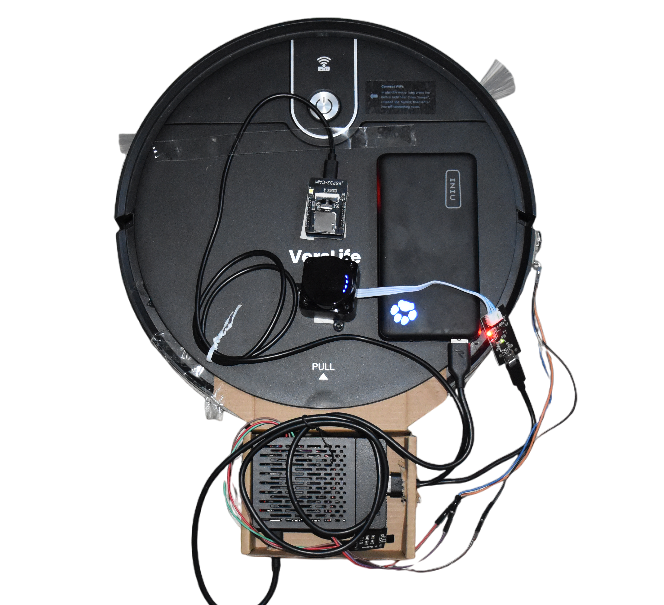
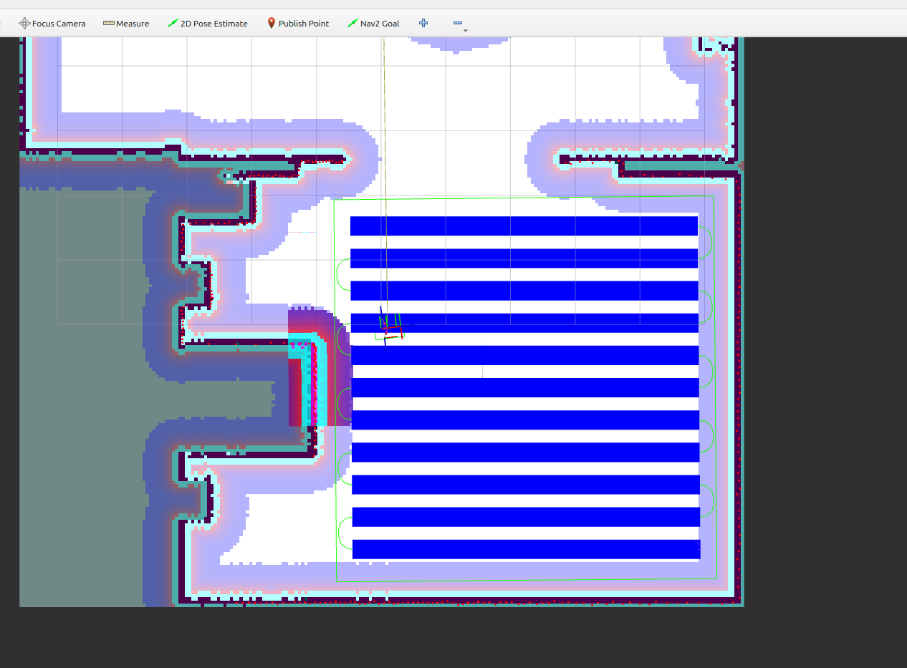
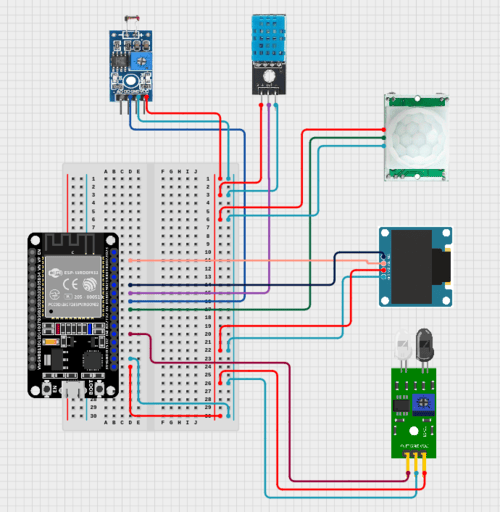
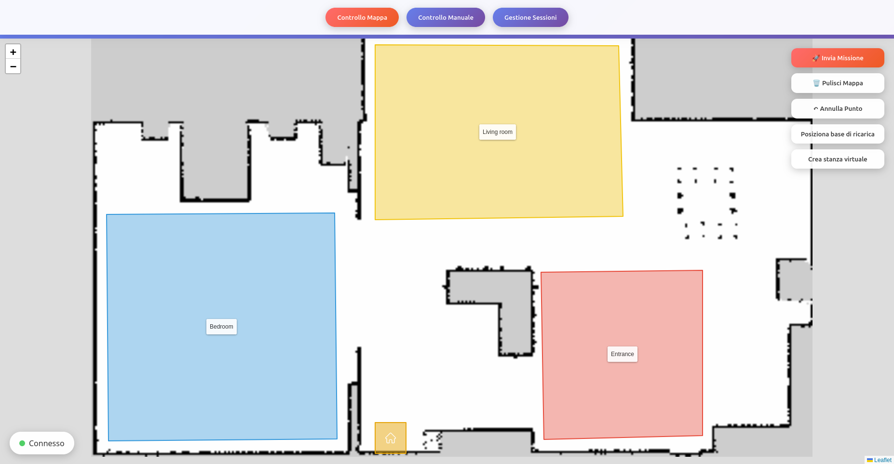
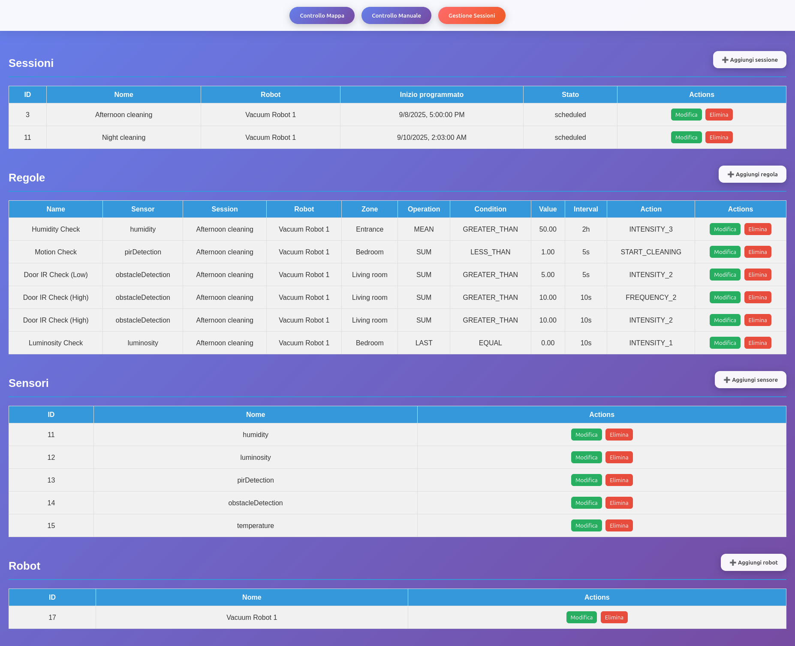

# IoRT Project - Internet of Robotic Things Vacuum System

This project was developed as a case study for the course **Programming for the Internet of Things** at the University of Urbino Carlo Bo.  
The goal is to integrate a low-cost commercial robotic vacuum cleaner into an **IoRT (Internet of Robotic Things)** ecosystem, enhanced with environmental sensors and an IoT infrastructure based on Docker containers.

Here's a short description of the main components of this project:
- **MQTTSensorNode**: Arduino (ESP32) code for MQTT sensor nodes
- **vacuumbot**: ROS2 package for the robotic vacuum
- **web_interface**: Web interface for control and configuration

## VacuumBot ROS2 package

ROS2 package that handles:
- Integration with the physical vacuum cleaner via IR commands  
- Integration with the IORT system via a MQTT bridge
- Cleaning/coverage plan generation

The robotic vacuum cleaner used in this project is a low-cost commercial device, modified to be part of the IoRT ecosystem.  
Key components include:

- **IR transmitter and receiver** → Used to externally control the robot by reproducing the same IR commands as the original remote control.  
- **LiDAR LD19** → A 2D LiDAR sensor used to create a map of the environment and localize the robot. It is connected to the Raspberry Pi via a USB-to-UART/TTL adapter.  
- **ESP32-CAM** → A small, low-cost camera module with an onboard ESP32, providing a POV (Point of View) stream from the robot.  
- **Raspberry Pi 4** → The “brain” of the robot. It processes onboard sensor data, communicates with an edge computer for planning, and controls the robot via the IR transmitter.  
- **Powerbank (5V/3A)** → Provides power to all the additional components.  

The robot itself has limited built-in “intelligence”.  
By integrating it with ROS2, external sensors, and the IoT infrastructure, its capabilities are extended to include autonomous navigation, environmental awareness, and remote control.

  

## Other ROS packages used
The `vacuumbot/` package provides the main integration with the robotic vacuum cleaner, enabling both simulation and real-world operation.  
It works together with several ROS2 packages:

- **vacuumbot/** → Main integration package for the robotic vacuum, handles communication with the robot.
- **SLAM Toolbox** → Generates 2D maps and handles localization using LiDAR data.
- **Nav2** → Performs autonomous navigation and path planning on the generated map.
- **OpenNav-Coverage** → Generates optimal coverage paths for cleaning or exploration.
- **StepController** → Custom node that converts continuous navigation commands into discrete IR signals.
- **Gazebo** → Simulates the robot and environment for testing SLAM, navigation, and coverage.
- **RViz2** → Visualizes the robot state, LiDAR scans, maps, and camera feed.

**Coverage zone example**

  

## MQTT Sensor Node (ESP32)

Arduino sketch (`MQTTSensorNode.ino`) for an **ESP32** board.  
It reads data from multiple sensors:
- PIR (motion)  
- IR (obstacles)  
- Light  
- Temperature & Humidity  

Then it publishes data periodically to the MQTT broker.

  

## Web Interface

A simple HTML/CSS/JS interface for:
- Configuring cleaning zones  
- Defining rules and schedules  
- Sending commands to the robot  
- Monitoring sensors in real-time  

**Zones management page**

  

**Sessions & Rules management page**

  

## Documentation
For more details on the achieved results, refer to the following <a href="/presentation.pdf" target="_blank">presentation</a>.

Here you can read the <a href="report/report.pdf" target="_blank">full report</a> (in italian though). 

