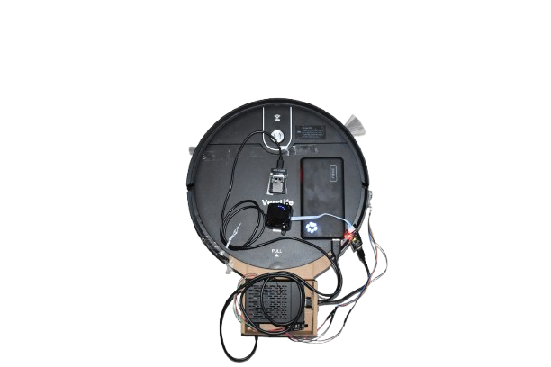

# IoRT Project - Internet of Robotic Things Vacuum System

This project was developed as a case study for the course **Programming for the Internet of Things** at the University of Urbino Carlo Bo.  
The goal is to integrate a low-cost commercial robotic vacuum cleaner into an **IoRT (Internet of Robotic Things)** ecosystem, enhanced with environmental sensors and an IoT infrastructure based on Docker containers.

## Project Structure
.
|---MQTTSensorNode/ # Arduino (ESP32) code for MQTT sensor nodes
|---iotstack/ # Backup of the IOTstack configuration (Docker + services)
|---vacuumbot/ # ROS2 package for the robotic vacuum
|---web_interface/ # Web interface for control and configuration

## VacuumBot (ROS2)

ROS2 package that handles:
- Integration with the physical vacuum cleaner via IR commands  
- Integration with the IORT system via a MQTT bridge

  

- **Documentation**  
  - `report.pdf` → Detailed technical report  
  - `presentation.pdf` → Project presentation  

## Screens
### Web interface (map)
### Web interface (manual control)
### Web interface (sessions & rules)

  

